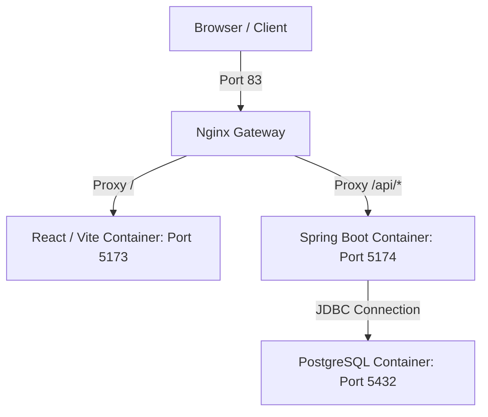

# Zariya Finance - Developer Environment

Welcome to the Zariya Finance repository! This project is containerized using Docker and orchestrated with Docker Compose to provide a unified, lightweight, and zero-configuration development workspace for the team.

---

## 🏗️ Architecture Overview

The system runs four separate containers communicating over a private virtual bridge network:



### Container Registry
*   **`nginx` (Gateway)**: The main entry point. Listens on host port **`83`**. It routes frontend routes directly to Vite and API requests starting with `/api/` to the backend.
*   **`frontend`**: Serves the React application using Vite on container port `5173` (bound to `127.0.0.1:5173` on host).
*   **`backend`**: Serves the Java Spring Boot REST API on container port `5174` (bound to `127.0.0.1:5174` on host).
*   **`db`**: Runs PostgreSQL 15 (bound to `127.0.0.1:5433` on the host to prevent conflicts with any local host database).

---

## ⚡ Getting Started

### Prerequisites
Make sure you have [Docker](https://docs.docker.com/) and [Docker Compose](https://docs.docker.com/compose/) installed on your machine.

### Quick Start
To start all services, run the Docker Compose command:

```bash
docker compose up --build
```

Once running, access the application in your browser at:
👉 **[http://localhost:83](http://localhost:83)**

---

## 🛠️ Developer Workflows

This environment is optimized for rapid local development. You **never** need to rebuild the Docker images when editing code.

### 🎨 Frontend Developer Workflow
*   **How it works:** The `frontend` container mounts your host's `./frontend` directory directly into the container. 
*   **Hot Reloading:** When you modify any React code (components, styles, layout) on your host computer, the changes are instantly synced into the container, triggering Vite's Hot Module Replacement (HMR) in your browser.
*   **Adding Packages:** If you need to install a new npm package, run `npm install <package>` in your host `./frontend` directory. The container will automatically pick it up, or you can restart the container to let it install package updates automatically from its shared cache.

### ☕ Backend Developer Workflow
*   **How it works:** The `backend` container mounts `./backend/finance` directly and runs the Spring Boot application using `./gradlew bootRun` inside a JRE Alpine container.
*   **Gradle Caching:** Dependencies are cached in a persistent named Docker volume (`gradle_cache`), meaning container restarts take only seconds.
*   **Hot Swapping (DevTools):** We use Spring Boot DevTools. When you compile code in your host IDE, the changes are automatically hot-swapped in the container.
*   **Context Restart:** If you need to manually force the backend to compile and restart, run:
    ```bash
    docker compose restart backend
    ```
    This takes under 3 seconds to complete (bypassing slow Docker build layers).

### 🐳 Target Start Option (Run Backend Only)
If you only want to work on the backend API or databases without running the frontend:
```bash
docker compose up -d backend
```
*Compose will start PostgreSQL, wait for it to be healthy, and start Spring Boot, leaving the Node/React and Nginx containers off.*

---

## 🗄️ Database Schema & Version Control (Flyway)

We manage the database structure using **Flyway Database Migrations**. 

### Rules & Configuration:
1. **Single Source of Truth:** Spring Data JPA's automatic schema updates are disabled (`ddl-auto=validate`). Database updates must be written as SQL files.
2. **Migration Scripts:** Place all SQL migration scripts under `backend/finance/src/main/resources/db/migration/`.
3. **Naming Convention:** Scripts must follow the exact syntax `V<VERSION>__<description>.sql` (e.g. `V1__create_messages_table.sql`).
4. **Volume Reset:** If you need to completely clear database tables and re-run all Flyway migrations from scratch:
   ```bash
   docker compose down -v
   ./start-docker.sh
   ```

---

## 🤝 Git & Team Collaboration Pipeline

When working in a team, the pipeline remains simple:

1. **Pull changes:** Run `git pull origin main`. Any updated dependencies in `package.json` or `build.gradle` will be automatically cached and handled by Docker.
2. **Write code:** Work natively on your host machine inside your favorite IDE. 
3. **Commit & Push:** Simply add, commit, and push your code files:
   ```bash
   git add .
   git commit -m "feat: added new message filtering endpoint"
   git push origin main
   ```
   *Note: Our root `.gitignore` is pre-configured to exclude all container logs, Gradle caches, npm caches, and database folders.*
